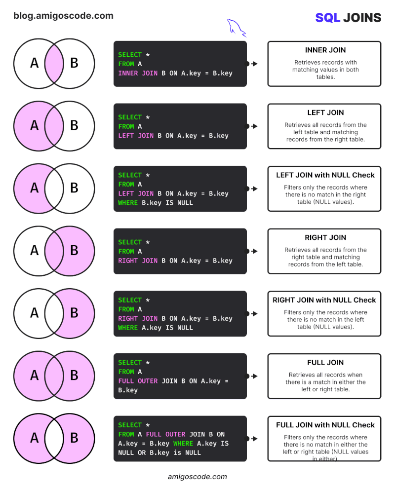

##                                                                               𝟕 𝐒𝐐𝐋 𝐉𝐨𝐢𝐧𝐬 𝐘𝐨𝐮 𝐌𝐮𝐬𝐭 𝐊𝐧𝐨𝐰

➡️ 𝐈𝐧𝐧𝐞𝐫 𝐉𝐨𝐢𝐧: Retrieves records with matching values in both tables.

➡️ 𝐋𝐞𝐟𝐭 𝐉𝐨𝐢𝐧: Retrieves all records from the left table and matching records from the right table.

➡️ 𝐋𝐞𝐟𝐭 𝐉𝐨𝐢𝐧 𝐰𝐢𝐭𝐡 𝐍𝐮𝐥𝐥 𝐂𝐡𝐞𝐜𝐤: Filters only the records where there is no match in the right table (NULL values).

➡️ 𝐑𝐢𝐠𝐡𝐭 𝐉𝐨𝐢𝐧: Retrieves all records from the right table and matching records from the left table.

➡️ 𝐑𝐢𝐠𝐡𝐭 𝐉𝐨𝐢𝐧 𝐰𝐢𝐭𝐡 𝐍𝐮𝐥𝐥 𝐂𝐡𝐞𝐜𝐤: Filters only the records where there is no match in the left table (NULL values).

➡️ 𝐅𝐮𝐥𝐥 𝐉𝐨𝐢𝐧: Retrieves all records when there is a match in either the left or right table.

➡️ 𝐅𝐮𝐥𝐥 𝐉𝐨𝐢𝐧 𝐰𝐢𝐭𝐡 𝐍𝐮𝐥𝐥 𝐂𝐡𝐞𝐜𝐤: Filters only the records where there is no match in either the left or right table (NULL values).

-----------------------------------------
###                     𝗠𝗮𝘀𝘁𝗲𝗿𝗶𝗻𝗴 𝗦𝗤𝗟 𝗳𝗼𝗿 𝗗𝗮𝘆-𝘁𝗼-𝗗𝗮𝘆 𝗗𝗮𝘁𝗮𝗯𝗮𝘀𝗲 𝗪𝗼𝗿𝗸: 𝗙𝗼𝗰𝘂𝘀 𝗼𝗻 𝘁𝗵𝗲 𝗙𝘂𝗻𝗱𝗮𝗺𝗲𝗻𝘁𝗮𝗹𝘀 

When diving into SQL, it’s easy to feel overwhelmed by the sheer number of commands and functions available. But here’s the secret: 𝘆𝗼𝘂 𝗱𝗼𝗻’𝘁 𝗻𝗲𝗲𝗱 𝘁𝗼 𝗺𝗮𝘀𝘁𝗲𝗿 𝗲𝘃𝗲𝗿𝘆𝘁𝗵𝗶𝗻𝗴 to be effective in your day-to-day database work! 

The 𝟴𝟬/𝟮𝟬 𝗽𝗿𝗶𝗻𝗰𝗶𝗽𝗹𝗲 applies perfectly here. 𝟴𝟬% 𝗼𝗳 𝘆𝗼𝘂𝗿 𝘄𝗼𝗿𝗸 will involve just 𝟮𝟬% 𝗼𝗳 𝘁𝗵𝗲 𝗦𝗤𝗟 𝗰𝗼𝗺𝗺𝗮𝗻𝗱𝘀. 

Core commands like:
- 𝚂𝙴𝙻𝙴𝙲𝚃
- 𝙸𝙽𝚂𝙴𝚁𝚃
- 𝚄𝙿𝙳𝙰𝚃𝙴
- 𝙳𝙴𝙻𝙴𝚃𝙴
- 𝙶𝚁𝙾𝚄𝙿 𝙱𝚈
- 𝙾𝚁𝙳𝙴𝚁 𝙱𝚈
- 𝚆𝙸𝚃𝙷
- 𝙼𝙰𝚇, 𝙼𝙸𝙽, 𝙲𝙾𝚄𝙽𝚃
- 𝙹𝙾𝙸𝙽, 𝙻𝙸𝙼𝙸𝚃

These will be your bread and butter! 

𝗙𝗼𝗰𝘂𝘀 𝗼𝗻 𝗺𝗮𝘀𝘁𝗲𝗿𝗶𝗻𝗴 𝘁𝗵𝗲𝘀𝗲 𝗲𝘀𝘀𝗲𝗻𝘁𝗶𝗮𝗹𝘀 𝗳𝗶𝗿𝘀𝘁. Once you're comfortable with these, you can start layering on more advanced SQL skills as your work requires. 

By getting really good at the basics, you’ll be able to tackle most SQL tasks with confidence. 

Remember, learning SQL is a journey—it’s not about conquering everything at once. 
Build your skills strategically based on the needs of your work, and you’ll find that mastering SQL is not only achievable but also enjoyable.

